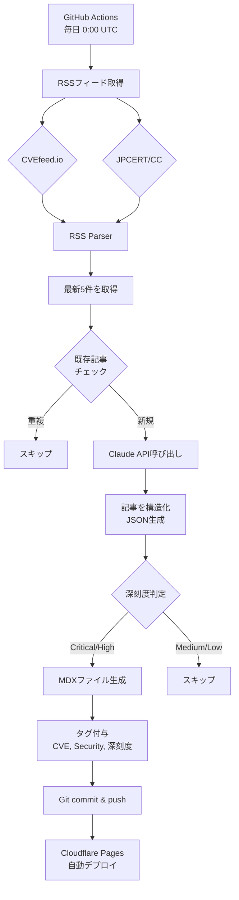

# 目的

セキュリティ脆弱性情報（CVE）は日々大量に公開されるが,英語の情報が多く,重要なものを見逃しがち.そこで,最新のCVE情報を自動収集し,AIで日本語記事として構造化する仕組みを作った.

**実現したこと:**
- RSSフィードから最新CVE情報を自動取得
- Claude APIで日本語に翻訳・構造化
- 重要度の高いもの（High/Critical）のみに絞る
- GitHub Actionsで毎日自動実行
- タグ付けで視覚的に区別

## システムワークフロー



## 技術スタック

- **RSS取得**: `rss-parser`
- **記事生成**: Claude API (`claude-sonnet-4-5-20250929`)
- **自動化**: GitHub Actions (daily cron)
- **フォーマット**: MDX (frontmatter + Markdown)
- **デプロイ**: Cloudflare Pages

## 実装のポイント

### 1. RSSソース

2つのソースからCVE情報を取得:

```javascript
const RSS_FEEDS = [
  "https://cvefeed.io/rssfeed/latest.xml",      // 世界のCVE情報
  "https://www.jpcert.or.jp/rss/jpcert.rdf",    // 日本のセキュリティ情報
];
```

### 2. Claude APIでの構造化

RSSの生データをClaudeに渡して以下のJSON形式で構造化:

```json
{
  "title": "記事タイトル（日本語）",
  "cve_id": "CVE-2025-XXXX",
  "severity": "critical/high/medium/low",
  "affected_products": ["製品リスト"],
  "summary": "1-2文の概要",
  "details": "詳細説明（Markdown）",
  "impact": "影響範囲",
  "mitigation": "対応方法"
}
```

### 3. 深刻度フィルタリング

重要度の高いもののみを記事化することでノイズを削減:

```javascript
if (article.severity === "high" || article.severity === "critical") {
  await generateMDXFile(article, item);
} else {
  console.log(`⏭️  Skipping ${article.severity.toUpperCase()} severity`);
}
```

### 4. 重複チェック

既存ファイル名からCVE IDを抽出して重複を防止:

```javascript
const existingIds = await getExistingCVEIds();
if (id && existingIds.has(id)) {
  console.log(`⏭️  Skipping existing: ${id}`);
  continue;
}
```

### 5. 自動生成される記事の構造

```yaml
---
title: "脆弱性のタイトル"
description: "概要"
date: "2025/10/20"
published: true
severity: "high"
cve_id: "CVE-2025-XXXXX"
tags: ["CVE", "Security", "High"]
---

# 🟠 脆弱性のタイトル

## 概要
...

## 影響範囲
...

## 対応方法
...
```

### 6. GitHub Actions設定

`.github/workflows/fetch-security-news.yml`:

```yaml
on:
  schedule:
    - cron: "0 0 * * *"  # 毎日 0:00 UTC (JST 9:00)
  workflow_dispatch:      # 手動実行も可能
```

## タグ機能

記事を視覚的に区別するためタグ機能を実装:

- **CVE記事**: `["CVE", "Security", "High"]` など
- **通常記事**: `["Blog", "Tech"]` など

一覧ページでタグバッジが表示され,CVE記事が一目でわかる.

## 工夫した点

### コスト削減

- 最新5件のみ処理（全件処理しない）
- 重複回避でAPI呼び出しを最小化
- レート制限対策で1秒待機

### 信頼性

- 元記事へのリンクを必ず含める
- 記事末尾に「自動生成」の注記
- 深刻度を絵文字で可視化（🔴🟠🟡🟢）

### 運用性

- `workflow_dispatch`で手動実行可能
- GitHub Actionsボットが自動コミット
- 一部失敗しても処理継続

## 今後の改善案

- [ ] Critical時のSlack通知
- [ ] カテゴリー別フィルタリング（Web/Network/OS）
- [ ] 影響製品のタグ化
- [ ] 週次サマリー記事の生成

## まとめ

GitHub ActionsとClaude APIを組み合わせることで,セキュリティ情報の収集から記事化までを完全自動化できた.

- **手間ゼロ**: 毎日自動で最新情報をチェック
- **日本語化**: 英語情報を自動翻訳・構造化
- **重要度フィルタ**: 本当に重要なものだけに絞れる

---

**実装ファイル**:
- スクリプト: `scripts/fetch-security-news.mjs`
- ワークフロー: `.github/workflows/fetch-security-news.yml`
- タグ追加スクリプト: `scripts/add-tags-to-cve.mjs`
